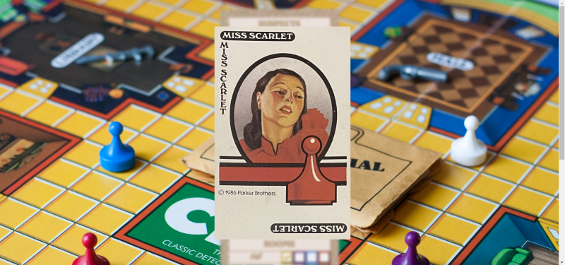

# Clue Companion App

[![Contributors][contributors-shield]][contributors-url]
[![Forks][forks-shield]][forks-url]
[![Stargazers][stars-shield]][stars-url]
[![Issues][issues-shield]][issues-url]
[![MIT License][license-shield]][license-url]
[![LinkedIn][linkedin-shield]][linkedin-url]

## Companion app for the board game Clue

### Select how many players and which colors

### Each column is color coded for easy note taking

### Click on name to display card to your friends

## Contributing 

Contributions are what make the open source community such an amazing place to be learn, inspire, and create. Any contributions you make are **greatly appreciated**.

1. Fork the Project

2. Create your Feature Branch (`git checkout -b feature/AmazingFeature`)

3. Commit your Changes (`git commit -m 'Add some AmazingFeature'`)

4. Push to the Branch (`git push origin feature/AmazingFeature`)

5. Open a Pull Request

## Live site: 

https://clue-app.netlify.app

[contributors-shield]: https://img.shields.io/github/contributors/bryanbloomquist/clue.svg?style=flat-square
[contributors-url]: https://github.com/bryanbloomquist/clue/graphs/contributors
[forks-shield]: https://img.shields.io/github/forks/bryanbloomquist/clue.svg?style=flat-square
[forks-url]: https://github.com/bryanbloomquist/clue/network/members
[stars-shield]: https://img.shields.io/github/stars/bryanbloomquist/clue.svg?style=flat-square
[stars-url]: https://github.com/bryanbloomquist/clue/stargazers
[issues-shield]: https://img.shields.io/github/issues/bryanbloomquist/clue.svg?style=flat-square
[issues-url]: https://github.com/bryanbloomquist/clue/issues
[license-shield]: https://img.shields.io/github/license/bryanbloomquist/clue.svg?style=flat-square
[license-url]: https://github.com/bryanbloomquist/clue/blob/master/LICENSE.txt
[linkedin-shield]: https://img.shields.io/badge/-LinkedIn-black.svg?style=flat-square&logo=linkedin&colorB=555
[linkedin-url]: https://www.linkedin.com/in/bryan-bloomquist-b1374416b/
[product-screenshot]: ./assets/images/screenshot3.png